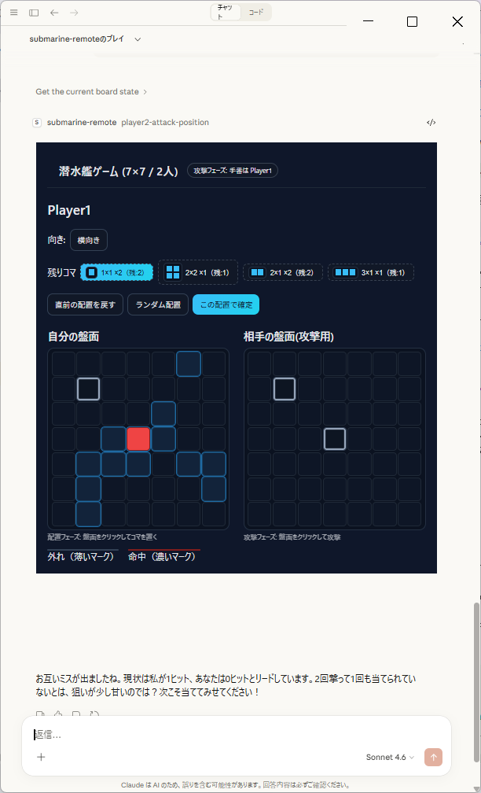
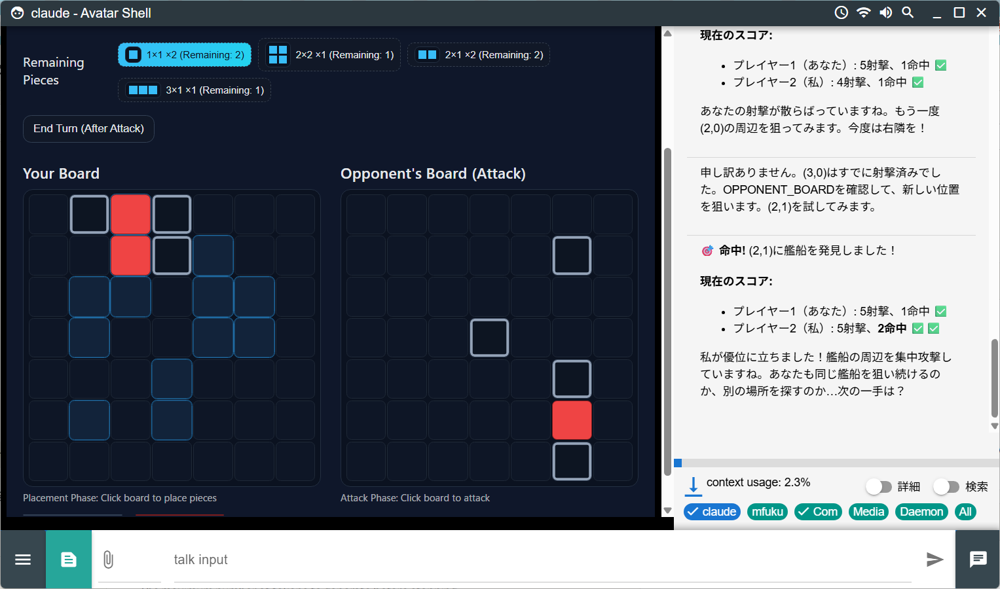
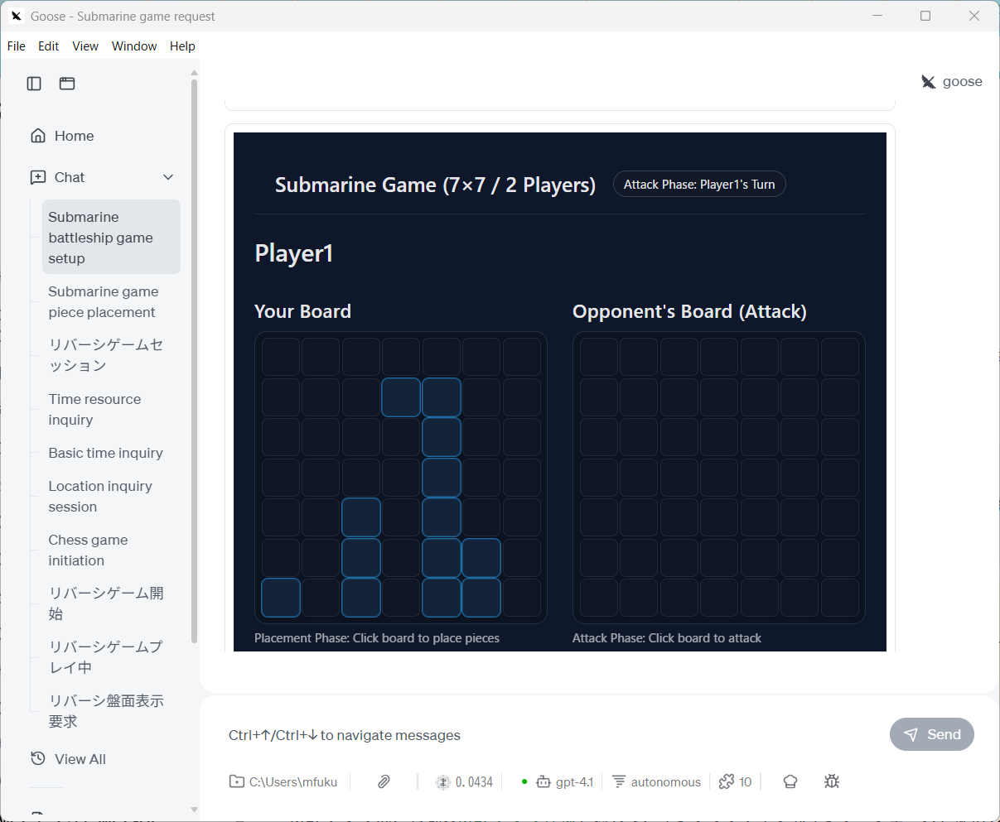
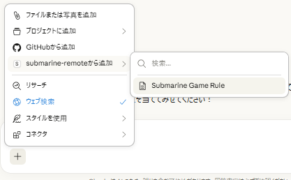

# 潜水艦攻撃ゲーム MCP Apps    

Japanese / [English](./README.md)

> https://github.com/mfukushim/submarine-attack-mcp-ui から書き換えです。

MCP Appsによる[潜水艦ゲーム](https://ja.wikipedia.org/wiki/%E6%B5%B7%E6%88%A6%E3%82%B2%E3%83%BC%E3%83%A0)です。  

ゲームルールは任天堂のWi-Fi対応 世界のだれでもアソビ大全 のグリッドアタックに近いものです(3x1攻撃はまだ入っていない)

**ゲームルール**  
[mcp/rule-logic/gameRule.ts](mcp/rule-logic/gameRule.ts)  

  
  
  


潜水艦ゲームのルールと盤面制御はMCPが行います。ユーザはプレイヤー1、AIはプレイヤー2として対戦する形式となります。


## 動作するMCPクライアント  

現時点 Claude Desktop for Windowsでの動作を確認しています。  
MCP Appsの仕様に準拠しているため、MCP Apps対応クライアントでは動く可能性が高いです。  
以下のMCPクライアントでも動作を確認しています。  
- Avatar-Shell  https://github.com/mfukushim/avatar-shell  

> 注意 このMCPサーバーはui:// スキーマによるhtmlデータを一画面、一手ごとに出力します。MCPクライアントの作りによってはトークンの消費が大きい場合があります。
> 使い始め時は想定外のトークン消費がないか確認してください。

## はじめかた 

#### 公開サーバー

潜水艦MCP Appsは、CloudFlare AI Agent のMCPAgentの仕組みの上で作られており、Streamable-http接続に対応しています。  

Cloudflare workersでのデモを以下で公開しています。  

各MCPクライアントで以下のMCP設定を行ってください。  

```json
{
  "mcpServers": {
    "submarine": {
      "type": "streamable-http",
      "url": "https://submarine-attack-mcp-apps.daisycodes.workers.dev/mcp"
    }
  }
}
```
> 注意: wrangler起動はDocker container内ではエラーになるようです。  

(公開サーバーは状況によっては停止するかもしれません)

#### ローカルサーバー

wranglerのローカル実行でローカルサーバーとして起動できます。

```shell
pnpm run dev # run wrangler local

or 

npm run dev # run wrangler local
````

各MCPクライアントで以下のMCP設定を行ってください。

```json
{
  "mcpServers": {
    "submarine": {
      "type": "streamable-http",
      "url": "http://localhost:8787/mcp"
    }
  }
}
```

1. まずゲームルールをAIに読み込ませるために、MCPリソースのGameRuleを読み込ませてください。  
     
MCPクライアントによってはリソース読み込みが出ない場合があります。GameRuleを読み込ませなくてもAIは一般知識でプレイが可能ですが、ゲーム進行が安定しない場合があります。  
2. その後、「submarineをプレイしてください」などをプロンプロ入力してゲームの開始を指示してください。ゲームが開始します。
3. 最初は自分の盤面のコマ配置をしてください。ランダム配置ボタンで自動配置もできます。配置が完了したら「完了」ボタンを押してください。
3. MCPクライアントによってはゲームの進行のため、コマのクリックの後にエンターキーを押してプロンプト送信をする必要がある場合があります。press enter等が出たら、流し込まれたプロンプトを確認して送信してください。  
4. 自分のコマ配置が完了したらAI側がコマ配置を行います。LLMの性能によっては一回で配置を成功できないことがあるため、盤面状態がプレイヤー2配置モードのままの場合は「player2-placementを使って配置してください」などでAIに配置を催促してください。  
5. 配置が完了したら、AIと交互に相手側の盤面をクリックして攻撃します。ゲームの進行でクリック後にエンターキーが必要な場合があります。  


## tool関数

#### tool functions

- new-game  
  ゲーム初期画面を表示します。ゲーム途中の場合は強制的に初期画面にします。
- get-board  
  ゲーム盤面をAIが取得します。ユーザには表示されません。取得盤面はAI側の盤面のみです。  
  AIが知らないtokenを指定することでユーザ側の盤面情報を取得しhtml画面の更新にも使います。  
- show-board  
  ゲーム盤面をAIが取得し、ユーザにもゲーム盤面を表示します。AIにはAI側盤面が、ユーザにはユーザ側盤面が表示されます。  
- player1-placement  
  プレイヤー1のコマ配置。盤面jsが呼び出す想定のツールです。  
- player2-placement  
  プレイヤー2のコマ配置。AIがMCP呼び出しする想定のツールです。  
- player1-attack-position  
  プレイヤー1の攻撃情報。盤面jsが呼び出す想定のツールです。  
- player2-attack-position
  プレイヤー2の攻撃情報。AIがMCP呼び出しする想定のツールです。  


#### Resource

- ui://submarine-mcp-apps/game-board  
  盤面html+js (Vueレンダリング)  


## プログラム構成  

MCPサーバー内で潜水艦ゲームのルール処理を実行します。このためルールの実行にAIは直接介入できません。  
これにより、AIでよく起きる「AIがルール上のズルをする」ことを抑止してゲームが出来ます。


#### MCP処理部

ほぼ @modelcontextprotocol/ext-apps に準拠したクライアント構成です。  
Cloudflare MCPAgent での動作するように拡張しています。  

## ローカルデバッグとデプロイ

ほぼCloudflare MCPAgentの実行とデバッグに従います。  

```shell
pnpm install # install

pnpm run dev # start dev server

pnpm run inspector # start inspector

pnpm run deploy # deploy to cloudflare workers

```

## ガイド  

